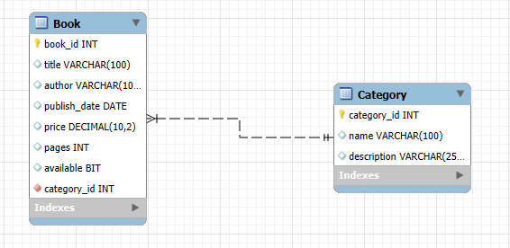
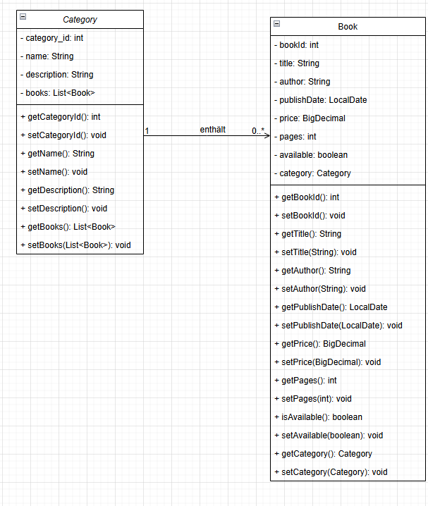
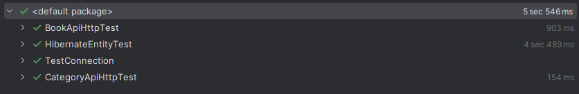

# Book Management API

## Beschreibung

Im Rahmen des Moduls M295 wurde eine REST-API zur Verwaltung von Büchern und Kategorien entwickelt.

Die Applikation basiert auf:

- Java
- Jersey (JAX-RS)
- Hibernate / JPA
- MySQL
- Maven
- JUnit
- Apache HttpClient

Die Datenbank besteht aus zwei miteinander verbundenen Tabellen:

- Book (Haupttabelle)
- Category (verknüpfte Tabelle)

Beziehung:

Eine Kategorie kann mehrere Bücher enthalten (1:n).

---
# Technologie-Stack

Für die Umsetzung des Projekts wurden folgende Technologien verwendet:

| Technologie | Zweck |
|------------|------------|
| Java 23 | Programmiersprache |
| Maven | Build- und Dependency-Management |
| Jersey (JAX-RS) | REST API |
| Hibernate / JPA | Persistenzschicht |
| MySQL | Datenbank |
| Tomcat 11 | Applikationsserver |
| JUnit 5 | Unit- und Integrationstests |
| Apache HttpClient | Testen der REST-Endpunkte |
| Git / GitHub | Versionsverwaltung |

---

# Architektur

Die Anwendung wurde nach dem Schichtenmodell aufgebaut.

```text
Client
  ↓
Resource (REST API)
  ↓
Service
  ↓
DAO
  ↓
Hibernate / JPA
  ↓
MySQL Datenbank
```


# Visuals

## ERD


Beschreibung:

Eine Kategorie kann mehrere Bücher enthalten. Jedes Buch gehört genau einer Kategorie.

---


## Klassendiagramm



Beschreibung:

Die Anwendung wurde nach folgendem Aufbau umgesetzt:

- Resource
- Service
- DAO
- Datenbank

---

## Screenshot der Testdurchführung



Beschreibung:

Die REST-Services wurden mit JUnit und Apache HttpClient getestet.

Es wurden sowohl positive als auch negative Testfälle umgesetzt.

Folgende Testklassen wurden erfolgreich ausgeführt:

- BookApiHttpTest
- CategoryApiHttpTest
- HibernateEntityTest
- TestConnection

Insgesamt wurden 29 von 29 Tests erfolgreich bestanden.

---

## Logging

Für die Nachvollziehbarkeit der Datenbankoperationen
werden Log-Ausgaben mittels SLF4J erzeugt.
---

# Validierungsregeln

Folgende Validierungsregeln wurden implementiert:

| Attribut | Regel |
|-----------|-----------|
| title | maximal 100 Zeichen |
| author | maximal 100 Zeichen |
| price | muss grösser als 0 sein |
| pages | muss grösser als 0 sein |
| description | maximal 255 Zeichen |

Validierungsfehler werden mit dem HTTP Statuscode 400 (Bad Request) zurückgegeben.

---

# Berechtigungsmatrix

| Service | PermitAll | USER | ADMIN |
|----------|----------|----------|----------|
| GET Books | X | X | X |
| GET Book by ID | X | X | X |
| GET Categories | X | X | X |
| GET Category by ID | X | X | X |
| POST Book | | | X |
| PUT Book | | | X |
| DELETE Book | | | X |
| POST Category | | | X |
| PUT Category | | | X |
| DELETE Category | | | X |
| POST Books Bulk | | | X |
| DELETE Books by Date | | | X |

Benutzer:

| Benutzer | Passwort | Rolle |
|------------|------------|------------|
| admin | 1234 | ADMIN |
| user | 1234 | USER |

Die Authentifizierung erfolgt über Basic Authentication und einen AuthenticationFilter.

---

# OpenAPI Dokumentation

Die vollständige OpenAPI-Spezifikation befindet sich unter:

[OpenAPI Dokumentation](docs/openapi.yaml)

Die Dokumentation enthält:

- Ressourcen (Paths)
- Parameter
- Request Bodies
- Responses
- Security Definitionen
- Datenmodelle (Schemas)
---

# Autor

Name: Tanushree Varma

Klasse: B24

Modul: M295

Dozent: Andreas Ilg

Git Repository:

https://github.com/ia24a-varmat/book-management-api.git

---

# Zusammenfassung

## Zusammenfassung

In diesem Projekt wurde eine REST-API zur Verwaltung von Büchern und Kategorien umgesetzt. Die Anwendung arbeitet mit einer MySQL-Datenbank, in der Bücher einer Kategorie zugeordnet werden. Dadurch entsteht eine 1:n-Beziehung zwischen den beiden Datenobjekten.

Die API wurde mit Jersey, Hibernate/JPA und Maven entwickelt. Über die REST-Endpunkte können Bücher und Kategorien erstellt, gelesen, aktualisiert und gelöscht werden. Zusätzlich wurden weitere Services wie das Zählen der Bücher, das Filtern nach Verfügbarkeit oder Preis sowie das Erstellen mehrerer Bücher umgesetzt.

Die Anwendung enthält Validierungen, Fehlerbehandlung, Logging und eine einfache Authentifizierung mit Rollen. Die Services wurden mit JUnit und Apache HttpClient getestet. Die Schnittstelle ist zusätzlich mit OpenAPI dokumentiert.

Damit zeigt das Projekt den vollständigen Aufbau einer Backend-Schnittstelle von der Datenbank über die Persistenz- und Service-Schicht bis zur REST-API.
